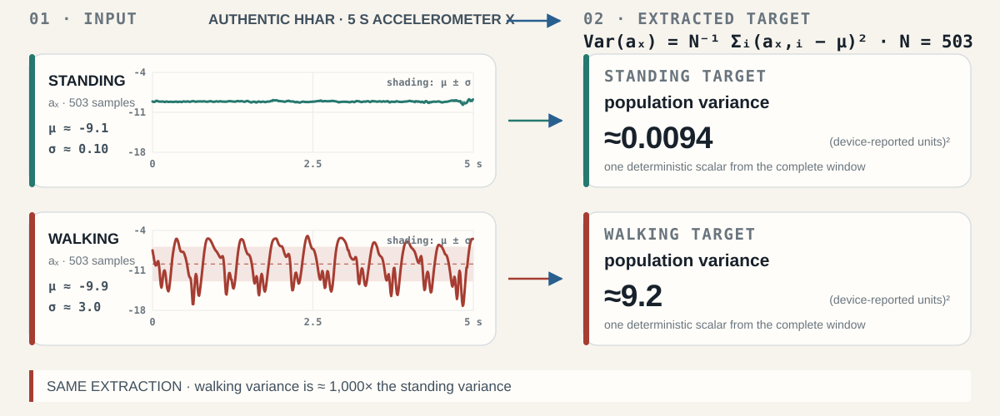
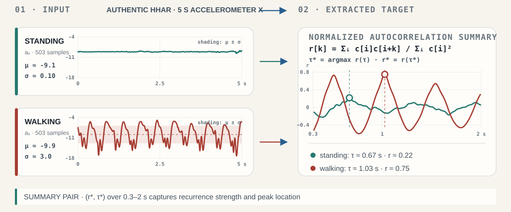
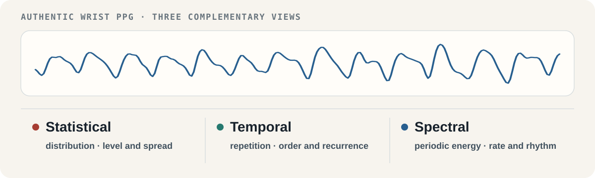

<!-- _class: title-slide -->
<!-- _paginate: false -->
<!-- _footer: '' -->

  

    
    
  

  
KDD MILETS WORKSHOP · 2026

# Feature-informed self-supervised learning for time-series understanding

  
Predicting engineered signal descriptors from unlabeled windows

  

    
Parv Thacker · Ayush Shrivastava · Nipun Batra

    
Indian Institute of Technology Gandhinagar

  

  
  

<!--
[Sources]
- Supplied workshop manuscript, p. 1, title and author list; p. 7, §8 Conclusion.
- Real signal: PPG-DaLiA Subject 1, samples 73,120–73,375, 2018-06-29 09:22:57–09:23:04.968750, 32 Hz, from the Edge Impulse CSV subset of the UCI PPG-DaLiA dataset (UCI DOI: 10.24432/C53890; subset documentation: https://docs.edgeimpulse.com/tutorials/end-to-end/hr-hrv-estimation). The strip is an editable SVG derived from those samples without synthetic interpolation.
- Device render: Empatica E4 official product page, https://www.empatica.com/research/e4/ .
- Sustainability Lab signature follows the user's `air-quality-talk` / `ccai` Marp visual language; the SVG viewBox was cropped to remove blank margins.
- KDD 2026 mark is from the supplied student deck.
-->

---

Motivation · acquisition

## Unlabeled windows are easier to acquire than task supervision

  

    

      
PPG-DaLiAheart-rate regression

      

        
        

          
AUTHENTIC 8 S WRIST PPG32 Hz · REFERENCE HR ≈100 BPM

          
        

      

      
<b>Continuous wrist PPG</b>Reference heart rate still needs synchronized ECG.

    

    

      
HHARactivity recognition

      

        
        

          
AUTHENTIC 5 S ACCELERATIONUSER A · GEAR_1

          
STANDING

          
WALKING

        

      

      
<b>Continuous inertial sensing</b>Activity labels still need an executed protocol.

    

  

Generated acquisition context; signal overlays are authentic PPG-DaLiA and HHAR records.

<!--
[Sources]
- Supplied workshop manuscript, p. 3, §3.4, evaluated datasets and downstream tasks.
- PPG overlay: PPG-DaLiA Subject 1, samples 73,120–73,375, 2018-06-29 09:22:57–09:23:04.968750, 32 Hz, median ECG-derived reference HR 100.35 BPM, from the Edge Impulse CSV subset of the UCI PPG-DaLiA dataset (UCI DOI: 10.24432/C53890; subset documentation: https://docs.edgeimpulse.com/tutorials/end-to-end/hr-hrv-estimation). Reference-heart-rate provenance follows Reiss et al., Sensors 2019, DOI 10.3390/s19143079.
- Audience-facing display rounds the reference HR to ≈100 BPM; the exact median reference is 100.35 BPM.
- HHAR windows: UCI Heterogeneity Activity Recognition dataset, DOI 10.24432/C5689X, CC BY 4.0; `Watch_accelerometer.csv`, user a, model gear, device gear_1; stand Index 2980–3482 and walk Index 13306–13808.
- The HHAR inset displays magnitude standard deviations as ≈0.09 and ≈3.1; the underlying asset values are 0.092 and 3.140 device-reported units.
- Acquisition-context images were generated with OpenAI ImageGen on 2026-08-09. They are conceptual only and do not depict PPG-DaLiA or HHAR participants, study devices, or acquisition sessions. Exact prompts are recorded in `provenance/imagegen-acquisition-prompts.txt`.
- Claim scope: this slide motivates why self-supervision is useful; it does not assert a particular unlabeled:labeled ratio for either benchmark.
-->

---

Analogy · computer vision

## For object identity, selected image transforms can preserve the learning target

  

    
    
one photographed instance

  

  

    

      

horizontal flip

      

crop

      

colour distortion

      

Gaussian blur

    

    
<strong>Why it works:</strong> the positive views can still depict the same cat.

  

CC0 photograph; all four views are deterministic CSS transforms of the same source image.

<!--
[Sources]
- Concept adapted from supplied student deck, slides 3–7.
- Cat photograph: Playing096, “Juvenile orange tabby cat,” Wikimedia Commons, CC0, https://commons.wikimedia.org/wiki/File:Juvenile_orange_tabby_cat.jpg .
- Flip, crop, colour distortion, and Gaussian blur are deterministic CSS renderings of the same source photograph; no generated image or second photograph is used.
- Transform selection follows the canonical SimCLR image-augmentation family: random crop/resize (with horizontal flip), colour distortion, and Gaussian blur. Chen et al., “A Simple Framework for Contrastive Learning of Visual Representations,” ICML 2020, PMLR 119:1597–1607, https://proceedings.mlr.press/v119/chen20j.html .
- Scientific qualification: this is an object-identity illustration. Moderate blur can preserve the cat-class target, but transformation validity is task-dependent and is not assumed for fine-grained, localization, text, or texture-dependent labels.
-->

---
<!-- _class: invariance-failure -->

Failure mode · task-mismatched invariance

## When a transformation changes signal semantics, invariance suppresses target-relevant structure

  

    
conceptual illustration · authentic PPG example follows

    
    
visual views: object identity can persistsignal views: temporal meaning can change

  

  

    

      
paired-view objective

      
z(x) ≈ z(T(x))

      
Encourages reduced sensitivity to view-specific differences.

    

    

      
required assumption

      
y(x) = y(T(x))

      
Requires the transformation to preserve the task target.

    

    

      
when the assumption fails

      
y(x) ≠ y(T(x))

      
Target-relevant evidence can be attenuated.

    

  

<b>For time series, that discarded difference can be the target:</b> temporal order · event presence · amplitude · local morphology

Conceptual ImageGen illustration; the next slide applies exact transformations to an authentic PPG-DaLiA window.

<!--
[Sources]
- Supplied workshop manuscript, p. 1, Abstract and Introduction: paired-view methods train representations of transformed views to remain similar; time-series transformations can alter order, continuity, amplitude, frequency structure, or physical coherence.
- Concept and comparison adapted from the supplied student deck, slides 7–10. The original untraceable MESA screenshot is not reused.
- Notation is explanatory: z denotes the learned representation, T the augmentation, and y the downstream target. The validity condition y(x)=y(T(x)) states the task-specific invariance required by the paired-view objective.
- The conceptual illustration was generated with OpenAI ImageGen on 2026-08-09. It is not a dataset record or empirical result; the exact prompt is recorded in `provenance/imagegen-invariance-prompt.txt`.
- Scientific boundary: the paper motivates this failure mode but does not directly test whether each augmentation changes a downstream label. The claim is conditional, not universal.
-->

---

<!-- _class: downstream-augmentation -->

Design test · task-specific invariance

## A transform is valid only if it preserves downstream evidence

  
  

    

      <b>PPG-DaLiA · heart-rate regression</b>
      <strong>Preserve beat interval and dominant frequency</strong>
      Reject T if beat timing or dominant-rate evidence becomes unreliable.
    

    

      <b>HHAR · activity recognition</b>
      <strong>Preserve amplitude, periodicity and transitions</strong>
      Reject T if cadence, intensity or a transition needed for classification is distorted.
    

    

      <b>Illustrative extension · event / anomaly detection</b>
      <strong>Preserve transient presence, duration and order</strong>
      Reject T if it masks, truncates or reorders the candidate event.
    

  

  
<b>Decision rule</b>Admit T as a positive-pair transform only when <i>y(x) = y(T(x))</i> and the evidence required for y remains physically plausible.

Authentic PPG-DaLiA example. Heart-rate and activity tasks are evaluated in this study; event detection is an illustrative extension.

<!--
[Sources]
- Supplied manuscript, p. 1, Abstract and §1, motivation concerning jitter, scaling, masking, reversal, and task-mismatched invariance.
- Supplied manuscript, p. 3, §3.4: the evaluated downstream tasks are heart-rate regression on PPG-DaLiA and activity recognition on HHAR.
- Real signal: PPG-DaLiA Subject 1, samples 73,120–73,375, 8 s at 32 Hz, UCI DOI 10.24432/C53890; Edge Impulse subset documentation: https://docs.edgeimpulse.com/tutorials/end-to-end/hr-hrv-estimation .
- Audience-facing labels name the operations directly. Exact operations: x̃(t) denotes the linearly detrended, within-window-scaled display signal; reverse sample order; zero samples 96–135 (3.00 ≤ t < 4.25 s); and 1.25 x̃(t) + 0.15 sin(2π·6t). All panels use the same 0–8 s and −3.25–3.25 axes.
- The downstream preservation test is explanatory and conditional: heart-rate regression requires recoverable rate/timing evidence; activity recognition can depend on amplitude, periodicity, and temporal transitions; event/anomaly detection is included only as an illustrative downstream extension and was not evaluated in the paper.
- The paper motivates, but does not directly test, semantic loss caused by these operations. No claim is made that every transformed window changes its downstream label.
-->

---

<!-- _class: concept-bridge feature-family-slide -->

Approach intuition · feature targets

## Each window supplies statistical, temporal, and spectral targets

  

<b>Target construction</b>select equal counts across families → compute per channel → concatenate → standardize over the pretraining dataset

One authentic PPG-DaLiA window; derived views illustrate what the descriptor families measure, not individual feature importance.

<!--
[Sources]
- Supplied workshop manuscript, pp. 2–3, §3.1–3.2: TSFEL targets span statistical, temporal, and spectral domains; examples named by the manuscript are mean, variance, and skewness; zero-crossing rate, autocorrelation, and temporal entropy; and spectral centroid, dominant frequency, and spectral entropy.
- The manuscript applies the feature extractor independently to each channel, concatenates the per-channel descriptors, selects equal numbers from the three domains for the 15/30/45/90-feature variants, and standardizes targets at dataset level before MSE regression.
- Real signal: PPG-DaLiA Subject 1, samples 73,120–73,375, 8 s at 32 Hz, UCI DOI 10.24432/C53890; subset documentation: https://docs.edgeimpulse.com/tutorials/end-to-end/hr-hrv-estimation .
- Audience-facing values are rounded. Exact values for this authentic window: median reference HR 100.35 BPM; detrended population standard deviation 59.8992378764 a.u. (59.899238 in the provenance table); IQR 99.2 a.u.; strongest local autocorrelation peak lag 0.594 s; 27 centered zero crossings; periodogram peak 1.671875 Hz (= 100.3125 cycles/min). Processing and provenance are documented in `provenance/ppg-intuition-assets.md`.
- Interpretive boundary: the listed descriptors are manuscript examples of each family. The study does not ablate individual descriptors or establish which feature is causally responsible for downstream performance.
-->

---

<!-- _class: feature-worked -->

Feature intuition · statistical target

## Walking variance is ≈1,000× the standing variance

  
  

    
03 · why it may help

    
<b>Motion-amplitude evidence</b>Predicting variance asks the encoder to retain per-axis amplitude spread—a cue for separating dynamic from nearly static windows.

    
evaluated downstream task<b>HHAR · activity recognition</b>

  

Authentic per-channel example; activity labels explain relevance but are not used during FI-SSL pretraining.

<!--
[Sources]
- Supplied workshop manuscript, pp. 2–3, §3.1–3.2: descriptors are extracted independently per channel, concatenated, standardized, and predicted with MSE; variance is named as a statistical example.
- UCI Heterogeneity Activity Recognition dataset, DOI 10.24432/C5689X, CC BY 4.0; authentic matched windows from `Watch_accelerometer.csv`, user a, model gear, device gear_1; standing Index 2980–3482 and walking Index 13306–13808; 503 samples per window.
- Rounded input annotations use the same authentic HHAR windows. Exact per-channel statistics: standing mean −9.114997203777335 and population standard deviation 0.09718303952992044; walking mean −9.885236338170971 and population standard deviation 3.035543872979065.
- Displayed input is the authentic smartwatch accelerometer x-axis on a common scale. Population Var(a_x)=(1/N)Σ_i(a_x,i−mean(a_x))²: standing 0.0094445432; walking 9.2145266048; ratio 975.646. The slide rounds these to ≈0.0094, ≈9.2, and ≈1,000×. Exact rows and values: `data/hhar-matched-standing-walking-window-data.csv`, `data/hhar-matched-standing-walking-window-features.csv`, and `provenance/hhar-feature-intuition-xaxis.txt`.
- Interpretive boundary: this example explains one deterministic statistical target. The paper does not establish variance as individually causal, and the activity labels are not used during pretraining.
-->

---

<!-- _class: feature-worked -->

Feature intuition · temporal target

## Walking shows a much stronger ≈1 s recurrence than standing

  
  

    
03 · why it may help

    
<b>Cyclic-timing evidence</b>Predicting an (r*, τ*) summary asks the encoder to retain recurrence strength and repeat interval—cues for periodic versus stationary activity.

    
evaluated downstream task<b>HHAR · activity recognition</b>

  

The same authentic windows reveal a different property: recurrence rather than amplitude spread.

<!--
[Sources]
- Supplied workshop manuscript, pp. 2–3, §3.2: temporal descriptor examples include zero-crossing rate, autocorrelation, and temporal entropy.
- UCI Heterogeneity Activity Recognition dataset, DOI 10.24432/C5689X, CC BY 4.0; same matched accelerometer-x windows as the statistical example: `Watch_accelerometer.csv`, user a, model gear, device gear_1; standing Index 2980–3482 and walking Index 13306–13808.
- Rounded input annotations use the same authentic HHAR windows. Exact per-channel statistics: standing mean −9.114997203777335 and population standard deviation 0.09718303952992044; walking mean −9.885236338170971 and population standard deviation 3.035543872979065.
- Explanatory calculation: interpolate timestamp-irregular a_x samples to each window's median sample-rate grid, subtract the mean, and compute normalized positive-lag autocorrelation r[k]=Σ_i c[i]c[i+k]/Σ_i c[i]². The displayed summary is the pair (r*,τ*), where τ*=argmax r(τ) over 0.3–2.0 s and r*=r(τ*). Standing: r*=0.2176483 at τ*=0.667990 s, displayed as r≈0.22 at τ≈0.67 s. Walking: r*=0.7502005 at τ*=1.0255195 s, displayed as r≈0.75 at τ≈1.03 s. Procedure and exact values: `provenance/hhar-feature-intuition-xaxis.txt`.
- Interpretive boundary: the displayed pair is an explanatory autocorrelation-derived summary, not a claim about the exact implementation of every TSFEL function or individual-feature importance. Activity labels are not used during FI-SSL pretraining.
-->

---

<!-- _class: feature-worked -->

Feature intuition · spectral target

## Dominant frequency aligns with reference heart rate in two PPG windows

  
  

    
03 · why it may help

    
<b>Pulse-rate evidence</b>Predicting dominant frequency asks the encoder to retain periodic rate—a cue for heart-rate regression.

    
evaluated downstream task<b>PPG-DaLiA · HR regression</b>

  

Selected authentic explanatory windows; not a representative error analysis or an individual-feature ablation.

<!--
[Sources]
- Supplied workshop manuscript, pp. 2–3, §3.2 and §3.4: spectral examples include spectral centroid, dominant frequency, and spectral entropy; PPG-DaLiA is evaluated for continuous heart-rate regression.
- PPG-DaLiA Subject 1 windows from the authentic Edge Impulse CSV subset of the UCI dataset, DOI 10.24432/C53890; 32 Hz; subset documentation: https://docs.edgeimpulse.com/tutorials/end-to-end/hr-hrv-estimation .
- Lower-rate window: samples 20,832–21,087, median reference HR 51.58 BPM; explanatory periodogram peak 0.859375 Hz = 51.5625 cycles/min. These are displayed as ≈52 BPM, ≈0.86 Hz, and ≈52 cycles/min. Higher-rate window: samples 73,120–73,375, median reference HR 100.35 BPM; peak 1.671875 Hz = 100.3125 cycles/min, displayed as ≈100 BPM, ≈1.67 Hz, and ≈100 cycles/min.
- Processing: least-squares linear detrending, Hann taper, 2,048-point zero-padded one-sided FFT, and maximum power in 0.5–3.2 Hz. Exact rows and processing: `data/ppg-intuition-windows.csv` and `provenance/ppg-intuition-assets.md`.
- Interpretive boundary: the windows were selected for pedagogical agreement. The visual is not a representative error analysis, an individual-feature ablation, or a claim about the exact implementation of every TSFEL spectral descriptor.
-->

---

<!-- _class: method-slide -->

Approach · fixed target, trainable encoder

## A fixed TSFEL target trains four alternative encoder backbones

  

Fixed target path; Eθ and Pφ train during pretraining. Pφ is then replaced by a task head; Eθ is evaluated frozen and fine-tuned.

<!--
[Sources]
- Supplied workshop manuscript, pp. 2–3, §3.1–3.4, Eqs. 1–3, and Table 1.
- Diagram structure was informed by supplied student deck slide 16, then rebuilt as an editable SVG.
- Axis-labelled input trace: PPG-DaLiA Subject 1, samples 73,120–73,375 in the aligned Edge Impulse subset, 256 samples at 32 Hz, from the UCI dataset, DOI 10.24432/C53890; subset documentation: https://docs.edgeimpulse.com/tutorials/end-to-end/hr-hrv-estimation . The plotted display signal subtracts the window's least-squares linear trend and divides by its population standard deviation (59.8992378764 a.u.); the horizontal axis is time within the 8 s half-open window. This display-only scaling is not the paper's training-set channel normalization.
- During pretraining, TSFEL extraction and the standardized descriptor target are fixed; encoder Eθ and feature-prediction head Pφ are trained jointly with MSE. The four encoder backbones are alternatives used in separate runs: MLP, MLP-Mixer, 1D ResNet-18, and PatchTST—not an ensemble.
- After pretraining, the implementation loads the pretrained encoder into a downstream model with a new task head. Frozen evaluation locks Eθ and trains Hψ only; end-to-end fine-tuning updates Eθ and Hψ. The pretraining feature head Pφ is not reused downstream.
- Implementation verification: `SSL-for-Time-Series` commit 96806c77649e83e6018f704cb0606a8312d50f52, `methods/tsfel15.py` (target standardization and joint encoder/head optimizer) and `core/engine.py` (new downstream head and frozen-encoder switch).
- The backbone glyphs are schematic family markers, not literal layer-by-layer architectures.
-->

---

Evidence · evaluated tasks

## The study evaluates two wearable-sensing tasks

  

    
<h3>PPG-DaLiA</h3>regression · MAE ↓

    

    

<b>15</b>participants

<b>PPG + ACC</b>channels retained

<b>HR</b>continuous target

  

  

    
<h3>HHAR</h3>classification · macro F1 ↑

    

    

<b>9</b>users

<b>ACC + GYR</b>sensor modalities

<b>6</b>activity classes

  

Sources: supplied manuscript §3.4; PPG-DaLiA and HHAR official dataset records.

<!--
[Sources]
- Supplied workshop manuscript, p. 3, §3.4.
- PPG-DaLiA: Reiss et al. 2019, DOI 10.3390/s19143079; UCI DOI 10.24432/C53890. The study retained PPG and accelerometer channels for heart-rate regression.
- HHAR: Stisen et al. 2015 / UCI DOI 10.24432/C5689X; smartphone and smartwatch accelerometer/gyroscope recordings from 9 users and six activities. Displayed windows: `Watch_accelerometer.csv`, user a, model gear, device gear_1; stand Index 2980–3482 and walk Index 13306–13808.
- The HHAR inset displays magnitude standard deviations as ≈0.09 and ≈3.1; the underlying asset values are 0.092 and 3.140 device-reported units.
- Empatica E4 render: official Empatica product page, https://www.empatica.com/research/e4/ .
- Signal strips are authentic dataset samples with provenance recorded in `provenance/ppg-intuition-assets.md` and `provenance/hhar-authentic-pair-manifest.txt`.
-->

---

<!-- _class: matched-settings-slide -->

Evaluation · define matched settings

## The design creates 160 matched settings per method

  

    

      
2datasets / tasks

      
<b>PPG-DaLiA</b>heart-rate regression

      
<b>HHAR</b>6-class activity recognition

    

    

      
4backbones · one per run

      
MLPMLP-Mixer1D ResNet-18PatchTST

    

    

      
20grouped settings <small>per dataset–backbone–method</small>

      
<b>12</b>
<strong>LR robustness</strong>frozen / unfrozen · pretrain LR 10⁻³ / 10⁻² fine-tune LR 10⁻⁵ / 10⁻⁴ / 10⁻³

      
<b>4</b>
<strong>Label scarcity</strong>5% / 100% labels × frozen / unfrozen

      
<b>4</b>
<strong>Head / pooling</strong>linear / MLP × mean / max

      
12 + 4 + 4 are additive studies—not one full-factorial sweep

    

  

  

<b>2</b> datasets × <b>4</b> backbones × <b>20</b> settings = <strong>160 matched settings per method</strong>
80 in PPG-DaLiA · 80 in HHAR

Source: supplied manuscript, Table 1 and §3.3–3.5. Settings are grouped studies, not a full-factorial sweep.

<!--
[Sources]
- Supplied workshop manuscript, p. 3, Table 1 and §3.3–3.5: two datasets, four alternative backbones, ten methods, and 20 grouped settings per dataset–backbone–method tuple yield 1,600 training runs.
- Backbones: MLP, MLP-Mixer, 1D ResNet-18, and PatchTST.
- Table 1 setting groups: 12 LR-robustness settings = frozen/unfrozen × pretraining LR 10⁻³/10⁻² × fine-tuning LR 10⁻⁵/10⁻⁴/10⁻³; 4 label-scarcity settings = 5%/100% labels × frozen/unfrozen; 4 head/pooling settings = linear/MLP head × mean/max pooling.
- Arithmetic: 2 datasets × 4 backbones × 20 settings = 160 matched settings per method across both tasks, or 80 per task.
- Boundary: the 20 settings are three additive studies (12 + 4 + 4), not one full-factorial crossing of every listed factor.
- The supplied student deck slide 18 and its staged continuation informed the 160-settings-first reveal; copy and arithmetic are reconciled to the active manuscript.
-->

---

<!-- _class: within-setting-slide -->

Evaluation · within-setting ranking

## Each matched setting compares the same ten methods

  

    

      
hold fixed

      
datasetbackbonegrouped setting

      <small>same task and evaluation condition</small>
    

    

      
vary one factor · pretraining method

      
<b>conventional SSL · 6</b>
SimCLRBYOLBarlow TwinsTS2VecSimMTMMPM

      
<b>feature-target SSL · 4</b>
TSFEL15TSFEL30TSFEL45TSFEL90

    

    

      
score with the task metric

      
PPG-DaLiA<b>MAE ↓</b>

      
HHAR<b>macro F1 ↑</b>

      
rank methods 1–10

    

  

  

    
<b>160</b> matched settings × <b>10</b> methods = <strong>1,600 training runs</strong>

    
<b>Within each task:</b> average a method's ranks over 80 settings · lower mean rank is better

  

Source: supplied manuscript, Table 1 and §3.3–3.5. Methods are ranked only within matched settings.

<!--
[Sources]
- Supplied workshop manuscript, p. 3, Table 1 and §3.3–3.5: two datasets, four alternative backbones, ten methods, and 20 grouped settings per dataset–backbone–method tuple yield 1,600 training runs.
- The ten methods are SimCLR, BYOL, Barlow Twins, TS2Vec, SimMTM, MPM, TSFEL15, TSFEL30, TSFEL45, and TSFEL90.
- Arithmetic: 160 matched settings × 10 methods = 1,600 training runs; each method contributes 80 matched settings within each task.
- Ranking protocol: methods are ranked only within a fixed experimental setting using MAE for PPG-DaLiA and macro F1 for HHAR; ranks are averaged separately within each task and lower mean rank is better.
- The supplied student deck slide 18 and its staged continuation informed the 160-settings → ten-method comparison → 1,600-run reveal; copy and arithmetic are reconciled to the active manuscript.
-->

---

Main result · heart-rate regression

## PPG-DaLiA: TSFEL15 has the lowest mean rank

  
  

    

mean rank ↓

3.95

<strong>TSFEL15</strong> has the lowest mean rank over 80 matched PPG-DaLiA settings.

    

observed mean MAE ↓

<strong>TSFEL30 · 11.58 BPM</strong> Barlow · 11.59 BPM No significance test is reported for the 0.01 BPM difference.

  

Source: supplied manuscript, Figure 1a, Table 2, and §4.1. Lower rank and lower MAE are better.

<!--
[Sources]
- Supplied workshop manuscript, p. 4, Table 2 and §4.1; p. 6, Figure 1a.
- Exact aggregate values: TSFEL15 mean rank 3.95; TSFEL30 mean MAE 11.58 BPM; Barlow mean MAE 11.59 BPM.
- Rank-distribution whisker/IQR/median geometry was reconstructed from the supplied paper figure. Its stale dashed mean marker was replaced with the exact final-manuscript mean rank from Table 2; the filled dot and right-column value are canonical.
- No confidence interval or inferential test is reported for the 0.01 BPM difference; the slide presents observed means only.
-->

---

Main result · activity classification

## HHAR: TSFEL45 leads both mean rank and macro F1

  
  

    

mean rank ↓

3.76

<strong>TSFEL45</strong> has the lowest mean rank over 80 matched HHAR settings.

    

mean macro F1 ↑

0.79

Barlow / SimCLR mean rank: <strong>4.43</strong>

  

Source: supplied manuscript, Figure 1b, Table 3, and §4.2. Lower rank and higher macro F1 are better.

<!--
[Sources]
- Supplied workshop manuscript, p. 4, Table 3; pp. 4–5, §4.2; p. 6, Figure 1b.
- Exact values: TSFEL45 mean rank 3.76 and mean macro F1 0.79; Barlow and SimCLR mean rank 4.43.
- Rank-distribution whisker/IQR/median geometry was reconstructed from the supplied paper figure. Its stale dashed mean marker was replaced with the exact final-manuscript mean rank from Table 3; the filled dot and right-column value are canonical.
-->

---

Representation transfer · frozen encoder

## In frozen evaluation, a TSFEL variant leads on both tasks

  
  
Each comparison selects the best member of each method family within that task and transfer regime.

Source: supplied manuscript, Tables 4–5 and §4.3.1. Only internally consistent average-rank columns are used.

<!--
[Sources]
- Supplied workshop manuscript, p. 5, Table 4 (HHAR) and Table 5 (PPG-DaLiA); p. 5, §4.3.1.
- Frozen: HHAR TSFEL45 2.68 vs BYOL 4.02; PPG-DaLiA TSFEL15 3.46 vs Barlow 4.38.
- Unfrozen context: HHAR TSFEL90 3.64 vs Barlow 3.90; PPG-DaLiA TSFEL30 3.85 vs MPM 5.51.
- Best family member changes by slice; the graphic does not compare one fixed TSFEL method against one fixed baseline.
- Table 5 integrity note: its caption states an unfrozen TSFEL30 MAE of 7.11 BPM, but active cells report 10.07, 7.47, and 6.93 for TSFEL30/45/90. This slide intentionally uses rank columns only and does not reproduce 7.11.
-->

---

Architecture · robustness

## On PPG-DaLiA, feature targets lead across all four backbones

  
  
The regression advantage is not confined to one encoder family; HHAR is more backbone dependent.

Source: supplied manuscript, §4.3.3. Lower normalized rank is better.

<!--
[Sources]
- Supplied workshop manuscript, p. 6, §4.3.3 Effect of Backbone Architecture.
- Exact PPG-DaLiA best-TSFEL versus closest-baseline normalized ranks: MLP 2.0 vs 4.2; MLP-Mixer 3.4 vs 5.8; ResNet-18 3.2 vs 4.6; PatchTST 3.6 vs 3.8.
- Boundary: the manuscript reports more varied HHAR behavior, including SimCLR outperforming TSFEL on MLP-Mixer. The slide therefore limits its headline to PPG-DaLiA.
- Graphic is an editable SVG reconstructed from the manuscript's exact prose values.
-->

---

Efficiency · paper's compute proxy

## Feature targets occupy the lower-left network-pass region

  

    
<h3>PPG-DaLiA</h3>

    
<h3>HHAR</h3>

  

  
<b>Preferred direction:</b> lower leftProxy ≠ wall-clock time, FLOPs, memory, energy, or carbon.

Source: supplied manuscript, Figure 2 and §4.4. Original point geometry is preserved.

<!--
[Sources]
- Supplied workshop manuscript, pp. 6–7, §4.4 and Figure 2.
- The x-axis is proportional to network passes required for training. It is not a measured wall-clock, FLOP, memory, energy, or carbon quantity.
- SVG paths and point geometry are preserved from the paper's supplied vector figure. Colors, direct labels, and the x-axis wording were revised for precision and legibility; no exact x-values were inferred or quoted.
-->

---

Ablation · target size

## The preferred descriptor count differs by task

  
  

    

15

<strong>PPG-DaLiA</strong> lowest mean rank: 3.95

    

45

<strong>HHAR</strong> lowest mean rank: 3.76

    
More targets do not improve mean rank monotonically.

  

Source: supplied manuscript, Tables 2–3 and §4.3.2. Lower mean rank is better.

<!--
[Sources]
- Supplied workshop manuscript, Tables 2–3 and p. 6, §4.3.2.
- Exact PPG-DaLiA mean ranks for 15/30/45/90 descriptors: 3.95, 4.15, 6.62, 5.88.
- Exact HHAR mean ranks: 4.64, 4.56, 3.76, 4.37.
- The plot retains exact point positions but omits duplicated point-value labels; the two task minima remain explicit in the right-hand callouts.
- Graphic is an editable SVG reconstructed from those exact table values. No trendline is fitted.
-->

---

Limits · what remains unresolved

## The experiments do not establish mechanism or broad transfer

  

    
<b>Two short-window wearable benchmarks</b>Heart-rate regression and six-class activity recognition.

    
<b>Matched evaluation across four backbones</b>Aggregate ranks over 1,600 training runs.

    
<b>Frozen and unfrozen transfer</b>Useful evidence on the evaluated tasks—not a universal claim.

  

  

    
not established

    <h3>Mechanism and scope</h3>
    <ul>
      <li data-marpit-fragment>Statistical, temporal, and spectral families are not disentangled.</li>
      <li data-marpit-fragment>No principled rule selects 15 / 30 / 45 / 90 targets.</li>
      <li data-marpit-fragment>Long-context, forecasting, anomaly, and cross-domain transfer are untested.</li>
      <li data-marpit-fragment>Augmentation-induced semantic loss is illustrated, not directly measured.</li>
    </ul>
  

Source: supplied manuscript, §7 Limitations.

<!--
[Sources]
- Supplied workshop manuscript, p. 7, §7 Limitations.
- The limitations copy closely follows the manuscript: descriptor choice remains an inductive bias; feature families are not ablated; subset selection lacks a principled rule; evaluation is limited to two wearable benchmarks with short fixed windows; motivating augmentation failures are not directly probed.
-->

---

<!-- _class: closing -->
<!-- _footer: '' -->

Conclusion · bounded claim

  

# Engineered descriptors provide useful self-supervision on the evaluated wearable tasks

  

    

01

Lowest task-level mean ranks on PPG-DaLiA and HHAR

    

02

Leading best-of-family ranks with a frozen encoder on both tasks

    

03

Favorable position under the paper's network-pass proxy

  

  
A complement to augmentation and reconstruction—not a universal replacement.

  

  

nipun.batra@iitgn.ac.in · Sustainability Lab, IIT Gandhinagar

<!--
[Sources]
- Supplied workshop manuscript, p. 7, §8 Conclusion.
- Task-level ranks: Tables 2–3. Frozen-transfer best-of-family ranks: Tables 4–5. Network-pass comparison: Figure 2 and §4.4.
- Closing visual: PPG-DaLiA Subject 1, samples 73,120–73,375 at 32 Hz, from the Edge Impulse subset of the UCI dataset, DOI 10.24432/C53890; subset documentation: https://docs.edgeimpulse.com/tutorials/end-to-end/hr-hrv-estimation . The closing variant intentionally omits numeric descriptor annotations; exact derived distribution, autocorrelation, and periodogram values are documented in `provenance/ppg-intuition-assets.md`.
- The boundary statement mirrors the manuscript's conclusion that descriptor prediction is complementary to augmentation- and reconstruction-based approaches rather than universally superior.
-->
