<!-- _class: title-slide -->
<!-- _paginate: false -->
<!-- _footer: '' -->

  

    
    
  

  
KDD MILETS WORKSHOP · 2026

# Feature-informed self-supervised learning for time-series understanding

  
Predicting engineered signal descriptors from unlabeled windows

  

    
Parv Thacker · Ayush Shrivastava · Nipun Batra

    
Indian Institute of Technology Gandhinagar

  

  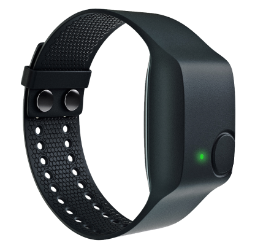
  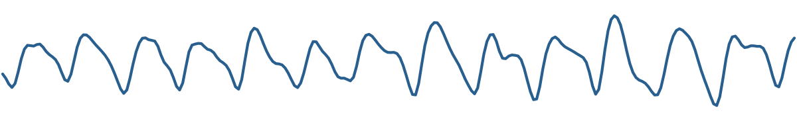

<!--
[Sources]
- Supplied workshop manuscript, p. 1, title and author list; p. 7, §8 Conclusion.
- Real signal: PPG-DaLiA Subject 1, samples 73,120–73,375, 2018-06-29 09:22:57–09:23:04.968750, 32 Hz, from the Edge Impulse CSV subset of the UCI PPG-DaLiA dataset (UCI DOI: 10.24432/C53890; subset documentation: https://docs.edgeimpulse.com/tutorials/end-to-end/hr-hrv-estimation). The strip is an editable SVG derived from those samples without synthetic interpolation.
- Device render: Empatica E4 official product page, https://www.empatica.com/research/e4/ .
- Sustainability Lab signature follows the user's `air-quality-talk` / `ccai` Marp visual language; the SVG viewBox was cropped to remove blank margins.
- KDD 2026 mark is from the supplied student deck.
-->

---

Motivation · acquisition

## Unlabeled windows are easier to acquire than task supervision

  

    

      
PPG-DaLiAheart-rate regression

      

        
        

          
AUTHENTIC 8 S WRIST PPG32 Hz · REFERENCE HR 100.35 BPM

          
        

      

      
<b>Continuous wrist PPG</b>Reference heart rate still needs synchronized ECG.

    

    

      
HHARactivity recognition

      

        
        

          
AUTHENTIC 5 S ACCELERATIONUSER A · GEAR_1

          
STANDING
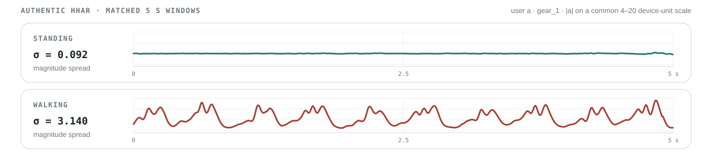

          
WALKING

        

      

      
<b>Continuous inertial sensing</b>Activity labels still need an executed protocol.

    

  

Generated acquisition context; signal overlays are authentic PPG-DaLiA and HHAR records.

<!--
[Sources]
- Supplied workshop manuscript, p. 3, §3.4, evaluated datasets and downstream tasks.
- PPG overlay: PPG-DaLiA Subject 1, samples 73,120–73,375, 2018-06-29 09:22:57–09:23:04.968750, 32 Hz, median ECG-derived reference HR 100.35 BPM, from the Edge Impulse CSV subset of the UCI PPG-DaLiA dataset (UCI DOI: 10.24432/C53890; subset documentation: https://docs.edgeimpulse.com/tutorials/end-to-end/hr-hrv-estimation). Reference-heart-rate provenance follows Reiss et al., Sensors 2019, DOI 10.3390/s19143079.
- HHAR windows: UCI Heterogeneity Activity Recognition dataset, DOI 10.24432/C5689X, CC BY 4.0; `Watch_accelerometer.csv`, user a, model gear, device gear_1; stand Index 2980–3482 and walk Index 13306–13808.
- Acquisition-context images were generated with OpenAI ImageGen on 2026-08-09. They are conceptual only and do not depict PPG-DaLiA or HHAR participants, study devices, or acquisition sessions. Exact prompts are recorded in `provenance/imagegen-acquisition-prompts.txt`.
- Claim scope: this slide motivates why self-supervision is useful; it does not assert a particular unlabeled:labeled ratio for either benchmark.
-->

---

Analogy · computer vision

## For object identity, selected image transforms can preserve the learning target

  

    
    
one photographed instance

  

  

    

horizontal flip

    

crop

    

colour distortion

    
<strong>Why it works:</strong> for an object-identity task, the positive views can still depict the same cat.

  

CC0 photograph; every view is generated deterministically from the same pixels.

<!--
[Sources]
- Concept adapted from supplied student deck, slides 3–7.
- Cat photograph: Playing096, “Juvenile orange tabby cat,” Wikimedia Commons, CC0, https://commons.wikimedia.org/wiki/File:Juvenile_orange_tabby_cat.jpg .
- Crop, flip, and colour transformation were produced in CSS from the same source photograph; no generated image is used.
- Scientific qualification: transformation validity depends on the learning target. This slide concerns object identity, not every vision task.
-->

---
<!-- _class: invariance-failure -->

Failure mode · task-mismatched invariance

## When a transformation changes signal semantics, invariance suppresses target-relevant structure

  

    
conceptual illustration · authentic PPG example follows

    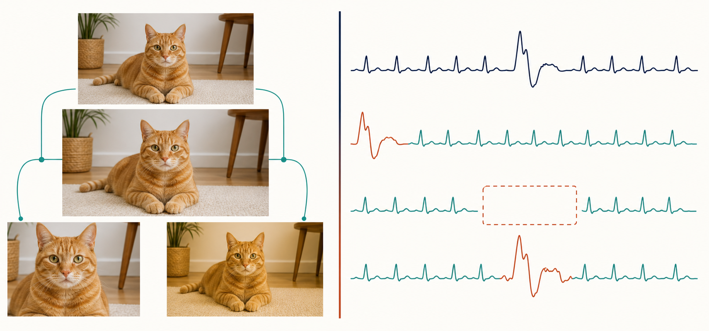
    
visual views: object identity can persistsignal views: temporal meaning can change

  

  

    

      
paired-view objective

      
z(x) ≈ z(T(x))

      
Encourages reduced sensitivity to view-specific differences.

    

    

      
required assumption

      
y(x) = y(T(x))

      
Requires the transformation to preserve the task target.

    

    

      
when the assumption fails

      
y(x) ≠ y(T(x))

      
Target-relevant evidence can be attenuated.

    

  

<b>For time series, that discarded difference can be the target:</b> temporal order · event presence · amplitude · local morphology

Conceptual ImageGen illustration; the next slide applies exact transformations to an authentic PPG-DaLiA window.

<!--
[Sources]
- Supplied workshop manuscript, p. 1, Abstract and Introduction: paired-view methods train representations of transformed views to remain similar; time-series transformations can alter order, continuity, amplitude, frequency structure, or physical coherence.
- Concept and comparison adapted from the supplied student deck, slides 7–10. The original untraceable MESA screenshot is not reused.
- Notation is explanatory: z denotes the learned representation, T the augmentation, and y the downstream target. The validity condition y(x)=y(T(x)) states the task-specific invariance required by the paired-view objective.
- The conceptual illustration was generated with OpenAI ImageGen on 2026-08-09. It is not a dataset record or empirical result; the exact prompt is recorded in `provenance/imagegen-invariance-prompt.txt`.
- Scientific boundary: the paper motivates this failure mode but does not directly test whether each augmentation changes a downstream label. The claim is conditional, not universal.
-->

---

<!-- _class: downstream-augmentation -->

Design test · task-specific invariance

## A transform is valid only if it preserves downstream evidence

  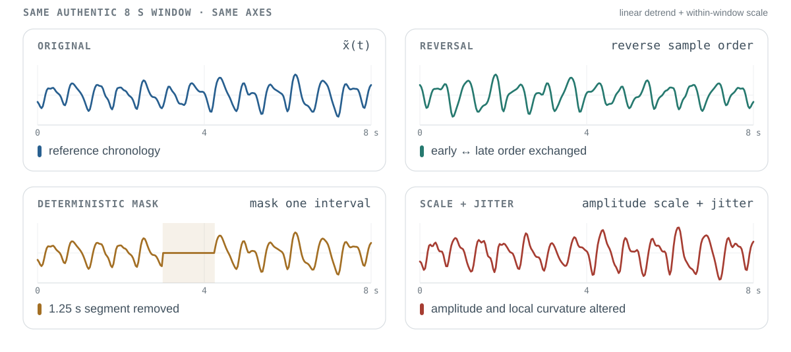
  

    

      <b>PPG-DaLiA · heart-rate regression</b>
      <strong>Preserve beat interval and dominant frequency</strong>
      Reject T if beat timing or dominant-rate evidence becomes unreliable.
    

    

      <b>HHAR · activity recognition</b>
      <strong>Preserve amplitude, periodicity and transitions</strong>
      Reject T if cadence, intensity or a transition needed for classification is distorted.
    

    

      <b>Illustrative extension · event / anomaly detection</b>
      <strong>Preserve transient presence, duration and order</strong>
      Reject T if it masks, truncates or reorders the candidate event.
    

  

  
<b>Decision rule</b>Admit T as a positive-pair transform only when <i>y(x) = y(T(x))</i> and the evidence required for y remains physically plausible.

Authentic PPG-DaLiA example. Heart-rate and activity tasks are evaluated in this study; event detection is an illustrative extension.

<!--
[Sources]
- Supplied manuscript, p. 1, Abstract and §1, motivation concerning jitter, scaling, masking, reversal, and task-mismatched invariance.
- Supplied manuscript, p. 3, §3.4: the evaluated downstream tasks are heart-rate regression on PPG-DaLiA and activity recognition on HHAR.
- Real signal: PPG-DaLiA Subject 1, samples 73,120–73,375, 8 s at 32 Hz, UCI DOI 10.24432/C53890; Edge Impulse subset documentation: https://docs.edgeimpulse.com/tutorials/end-to-end/hr-hrv-estimation .
- Exact operations: x̃(t) denotes the linearly detrended, within-window-scaled display signal; reverse sample order; zero samples 96–135 (3.00 ≤ t < 4.25 s); and 1.25 x̃(t) + 0.15 sin(2π·6t). All panels use the same 0–8 s and −3.25–3.25 axes.
- The downstream preservation test is explanatory and conditional: heart-rate regression requires recoverable rate/timing evidence; activity recognition can depend on amplitude, periodicity, and temporal transitions; event/anomaly detection is included only as an illustrative downstream extension and was not evaluated in the paper.
- The paper motivates, but does not directly test, semantic loss caused by these operations. No claim is made that every transformed window changes its downstream label.
-->

---

<!-- _class: concept-bridge feature-family-slide -->

Approach intuition · feature targets

## Each window supplies statistical, temporal, and spectral targets

  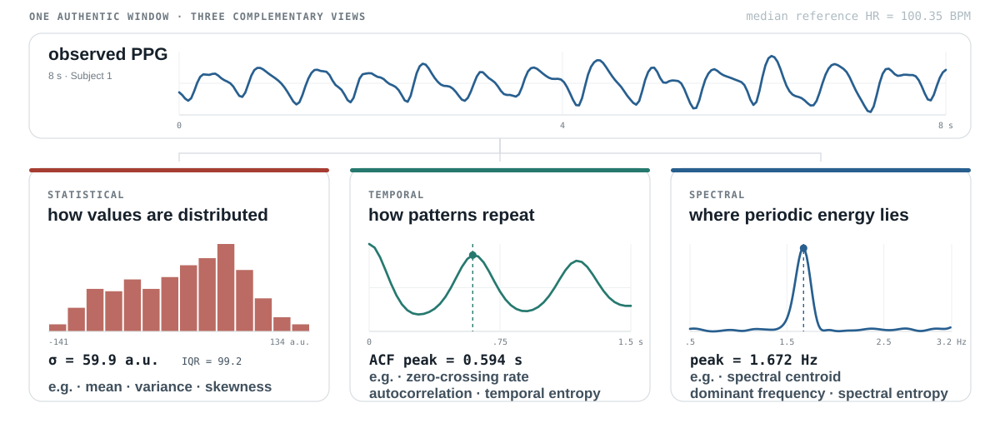

<b>Target construction</b>select equal counts across families → compute per channel → concatenate → standardize over the pretraining dataset

One authentic PPG-DaLiA window; derived views illustrate what the descriptor families measure, not individual feature importance.

<!--
[Sources]
- Supplied workshop manuscript, pp. 2–3, §3.1–3.2: TSFEL targets span statistical, temporal, and spectral domains; examples named by the manuscript are mean, variance, and skewness; zero-crossing rate, autocorrelation, and temporal entropy; and spectral centroid, dominant frequency, and spectral entropy.
- The manuscript applies the feature extractor independently to each channel, concatenates the per-channel descriptors, selects equal numbers from the three domains for the 15/30/45/90-feature variants, and standardizes targets at dataset level before MSE regression.
- Real signal: PPG-DaLiA Subject 1, samples 73,120–73,375, 8 s at 32 Hz, UCI DOI 10.24432/C53890; subset documentation: https://docs.edgeimpulse.com/tutorials/end-to-end/hr-hrv-estimation .
- Derived values in the graphic: standard deviation 59.9 a.u.; IQR 99.2; autocorrelation peak at 0.594 s; 27 centered zero crossings; periodogram peak 1.672 Hz (approximately 100.3 cycles/min). Processing and provenance are documented in `provenance/ppg-intuition-assets.md`.
- Interpretive boundary: the listed descriptors are manuscript examples of each family. The study does not ablate individual descriptors or establish which feature is causally responsible for downstream performance.
-->

---

Feature intuition · activity

## Statistical and temporal descriptors expose differences between activity windows

  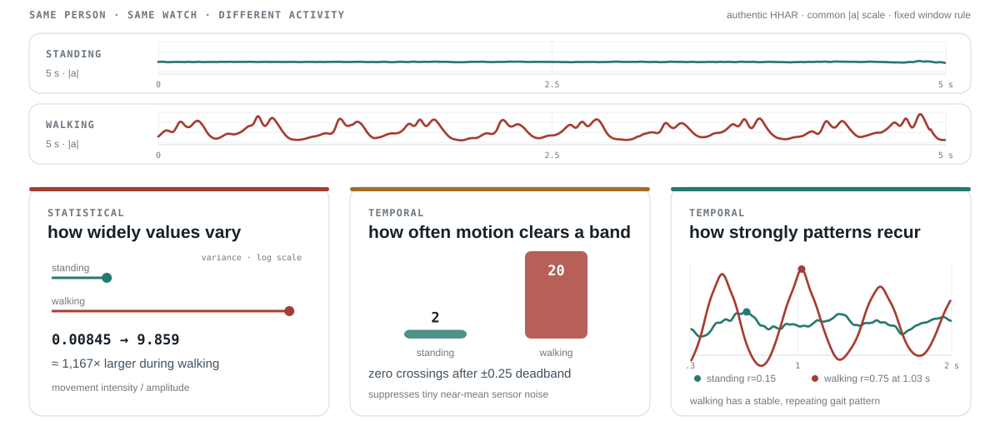
  
<b>Variance</b> · amplitude spread<b>Mean-band crossings</b> · thresholded transitions<b>Autocorrelation</b> · repeated temporal structure

Matched real HHAR windows from one user, device, and sensor; descriptors summarize structure, not feature importance.

<!--
[Sources]
- UCI Heterogeneity Activity Recognition dataset, DOI 10.24432/C5689X, CC BY 4.0; `Watch_accelerometer.csv`, user a, model gear, device gear_1; stand Index 2980–3482 and walk Index 13306–13808; 503 samples per window.
- Values shown: magnitude variance 0.00845 vs 9.859; ±0.25-deadband centered crossings 2 vs 20; autocorrelation maxima r=0.154 at 0.668 s vs r=0.751 at 1.026 s. Full selection rule and preprocessing: `provenance/hhar-authentic-pair-manifest.txt`.
- Descriptor-family motivation: supplied manuscript, pp. 2–3, §3.2.
- Interpretive boundary: the visualization explains what the descriptors measure; the paper does not ablate individual descriptors or establish that these three alone classify HHAR.
-->

---

Feature intuition · heart rate

## Spectral descriptors make periodic rate information explicit

  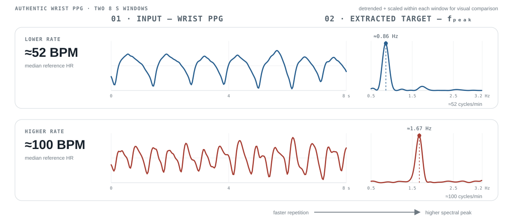
  
<b>Dominant frequency</b> · strongest periodic component<b>fpeak × 60</b> · cycles per minuteselected real windows · explanatory comparison

PPG-DaLiA Subject 1: 51.58 and 100.35 BPM reference windows; spectra derived from the observed wrist PPG.

<!--
[Sources]
- PPG-DaLiA Subject 1 windows from the Edge Impulse CSV subset of the UCI dataset, DOI 10.24432/C53890; 32 Hz; subset documentation: https://docs.edgeimpulse.com/tutorials/end-to-end/hr-hrv-estimation .
- Lower-rate window: samples 20,832–21,087, 2018-06-29 08:55:43–08:55:50.968750, median reference HR 51.58 BPM; periodogram peak 0.859375 Hz = 51.5625 BPM.
- Higher-rate window: samples 73,120–73,375, 2018-06-29 09:22:57–09:23:04.968750, median reference HR 100.35 BPM; periodogram peak 1.671875 Hz = 100.3125 BPM.
- Processing: linear detrending; Hann window; 2,048-point zero-padded one-sided FFT; normalized within 0.5–3.2 Hz. This is an explanatory periodogram, not a claim about the exact implementation of every TSFEL spectral descriptor.
- The windows were selected deliberately for pedagogical agreement and are not a representative error analysis; the paper does not isolate spectral-feature causality.
-->

---

Approach · two-path pretraining

## Pretraining predicts standardized TSFEL descriptors

  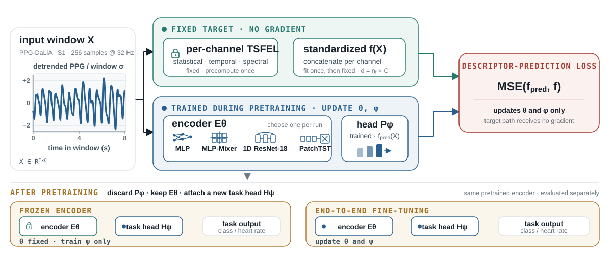
  
The method removes view construction—not inductive bias. Descriptor choice defines what the encoder is asked to retain.

Source: supplied manuscript, §3.1–3.2 and Eqs. 1–3. Fixed target branch and learned prediction branch meet only at the loss.

<!--
[Sources]
- Supplied workshop manuscript, pp. 2–3, §3.1–3.2 and Eqs. 1–3.
- Diagram structure was informed by supplied student deck slide 16, then rebuilt as an editable SVG.
- Small input trace: PPG-DaLiA Subject 1, samples 73,120–73,375 at 32 Hz, from the Edge Impulse subset of the UCI dataset, DOI 10.24432/C53890; subset documentation: https://docs.edgeimpulse.com/tutorials/end-to-end/hr-hrv-estimation .
- The TSFEL extractor is fixed and its targets may be computed once; encoder E and predictor P are learned during pretraining; P is discarded for downstream transfer.
-->

---

Evidence · evaluated tasks

## The study evaluates two wearable-sensing tasks

  

    
<h3>PPG-DaLiA</h3>regression · MAE ↓

    

    

<b>15</b>participants

<b>PPG + ACC</b>channels retained

<b>HR</b>continuous target

  

  

    
<h3>HHAR</h3>classification · macro F1 ↑

    

    

<b>9</b>users

<b>ACC + GYR</b>sensor modalities

<b>6</b>activity classes

  

Sources: supplied manuscript §3.4; PPG-DaLiA and HHAR official dataset records.

<!--
[Sources]
- Supplied workshop manuscript, p. 3, §3.4.
- PPG-DaLiA: Reiss et al. 2019, DOI 10.3390/s19143079; UCI DOI 10.24432/C53890. The study retained PPG and accelerometer channels for heart-rate regression.
- HHAR: Stisen et al. 2015 / UCI DOI 10.24432/C5689X; smartphone and smartwatch accelerometer/gyroscope recordings from 9 users and six activities. Displayed windows: `Watch_accelerometer.csv`, user a, model gear, device gear_1; stand Index 2980–3482 and walk Index 13306–13808.
- Empatica E4 render: official Empatica product page, https://www.empatica.com/research/e4/ .
- Signal strips are authentic dataset samples with provenance recorded in `provenance/ppg-intuition-assets.md` and `provenance/hhar-authentic-pair-manifest.txt`.
-->

---

Evaluation · matched comparisons

## The comparison spans 1,600 runs across matched settings

  

    

2
datasets

×

    

4
backbones

×

    

10
methods

×

    

20
configurations

  

  
= 1,600 training runs

  

    

01 · MATCH
<h3>Hold the setting fixed</h3>
Dataset, backbone, transfer regime, label fraction, and hyperparameters.

    
→

    

02 · RANK
<h3>Order the ten methods</h3>
Macro F1 for HHAR; MAE for PPG-DaLiA.

    
→

    

03 · AGGREGATE
<h3>Average within task</h3>
80 matched settings per method and dataset; lower mean rank is better.

  

  
20 configurations = 12 learning-rate robustness + 4 label-scarcity + 4 head/pooling160 runs per method across both tasks

Source: supplied manuscript, Table 1 and §3.3–3.5.

<!--
[Sources]
- Supplied workshop manuscript, p. 3, Table 1; pp. 3–4, §3.3–3.5.
- Arithmetic: 2 datasets × 4 backbones × 10 methods × 20 grouped configurations = 1,600 runs.
- Each method contributes 160 runs overall and 80 per dataset. Task-specific mean ranks in Tables 2–3 therefore aggregate 80 matched settings per method.
- The 20 settings are 12 + 4 + 4 grouped studies, not a full factorial design.
-->

---

Main result · heart-rate regression

## PPG-DaLiA: TSFEL15 has the lowest mean rank

  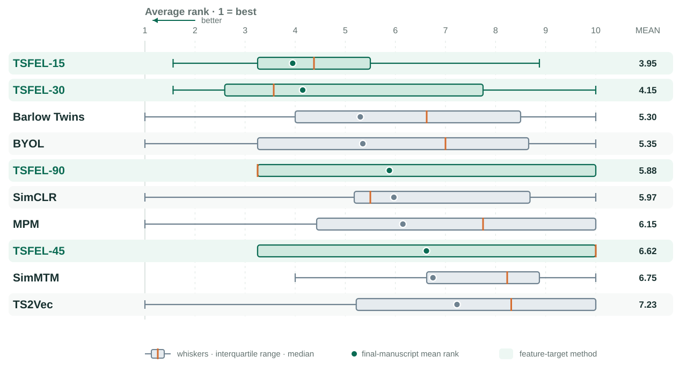
  

    
mean rank ↓

3.95

<strong>TSFEL15</strong> has the lowest mean rank over 80 matched PPG-DaLiA settings.

    

    
observed mean MAE ↓

<strong>TSFEL30 · 11.58 BPM</strong> Barlow · 11.59 BPM No significance test is reported for the 0.01 BPM difference.

  

Source: supplied manuscript, Figure 1a, Table 2, and §4.1. Lower rank and lower MAE are better.

<!--
[Sources]
- Supplied workshop manuscript, p. 4, Table 2 and §4.1; p. 6, Figure 1a.
- Exact aggregate values: TSFEL15 mean rank 3.95; TSFEL30 mean MAE 11.58 BPM; Barlow mean MAE 11.59 BPM.
- Rank-distribution whisker/IQR/median geometry was reconstructed from the supplied paper figure. Its stale dashed mean marker was replaced with the exact final-manuscript mean rank from Table 2; the filled dot and right-column value are canonical.
- No confidence interval or inferential test is reported for the 0.01 BPM difference; the slide presents observed means only.
-->

---

Main result · activity classification

## HHAR: TSFEL45 leads both mean rank and macro F1

  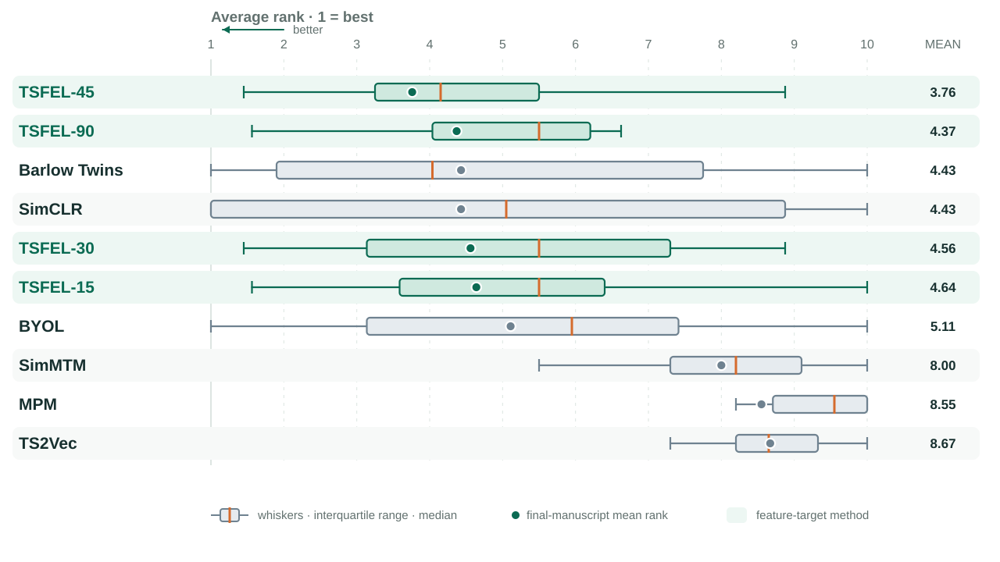
  

    
mean rank ↓

3.76

<strong>TSFEL45</strong> has the lowest mean rank over 80 matched HHAR settings.

    

    
mean macro F1 ↑

0.79

Barlow / SimCLR mean rank: <strong>4.43</strong>

  

Source: supplied manuscript, Figure 1b, Table 3, and §4.2. Lower rank and higher macro F1 are better.

<!--
[Sources]
- Supplied workshop manuscript, p. 4, Table 3; pp. 4–5, §4.2; p. 6, Figure 1b.
- Exact values: TSFEL45 mean rank 3.76 and mean macro F1 0.79; Barlow and SimCLR mean rank 4.43.
- Rank-distribution whisker/IQR/median geometry was reconstructed from the supplied paper figure. Its stale dashed mean marker was replaced with the exact final-manuscript mean rank from Table 3; the filled dot and right-column value are canonical.
-->

---

Representation transfer · frozen encoder

## In frozen evaluation, a TSFEL variant leads on both tasks

  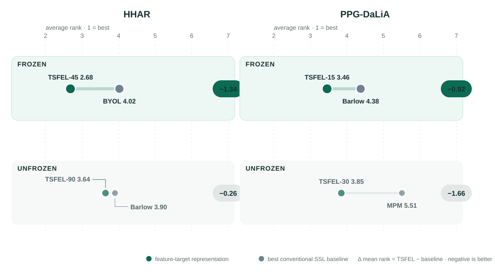
  
Each comparison selects the best member of each method family within that task and transfer regime.

Source: supplied manuscript, Tables 4–5 and §4.3.1. Only internally consistent average-rank columns are used.

<!--
[Sources]
- Supplied workshop manuscript, p. 5, Table 4 (HHAR) and Table 5 (PPG-DaLiA); p. 5, §4.3.1.
- Frozen: HHAR TSFEL45 2.68 vs BYOL 4.02; PPG-DaLiA TSFEL15 3.46 vs Barlow 4.38.
- Unfrozen context: HHAR TSFEL90 3.64 vs Barlow 3.90; PPG-DaLiA TSFEL30 3.85 vs MPM 5.51.
- Best family member changes by slice; the graphic does not compare one fixed TSFEL method against one fixed baseline.
- Table 5 integrity note: its caption states an unfrozen TSFEL30 MAE of 7.11 BPM, but active cells report 10.07, 7.47, and 6.93 for TSFEL30/45/90. This slide intentionally uses rank columns only and does not reproduce 7.11.
-->

---

Architecture · robustness

## On PPG-DaLiA, feature targets lead across all four backbones

  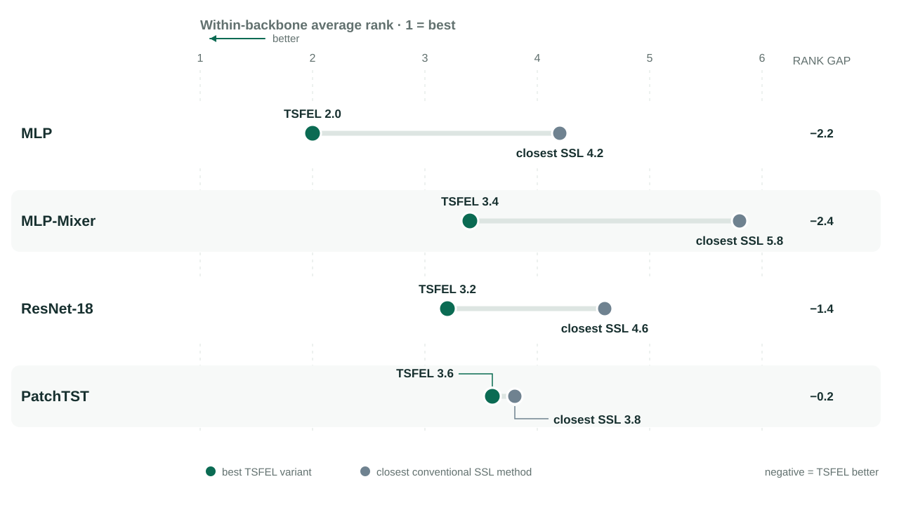
  
The regression advantage is not confined to one encoder family; HHAR is more backbone dependent.

Source: supplied manuscript, §4.3.3. Lower normalized rank is better.

<!--
[Sources]
- Supplied workshop manuscript, p. 6, §4.3.3 Effect of Backbone Architecture.
- Exact PPG-DaLiA best-TSFEL versus closest-baseline normalized ranks: MLP 2.0 vs 4.2; MLP-Mixer 3.4 vs 5.8; ResNet-18 3.2 vs 4.6; PatchTST 3.6 vs 3.8.
- Boundary: the manuscript reports more varied HHAR behavior, including SimCLR outperforming TSFEL on MLP-Mixer. The slide therefore limits its headline to PPG-DaLiA.
- Graphic is an editable SVG reconstructed from the manuscript's exact prose values.
-->

---

Efficiency · paper's compute proxy

## Feature targets occupy the lower-left network-pass region

  

    
<h3>PPG-DaLiA</h3>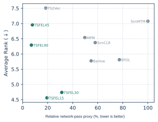

    
<h3>HHAR</h3>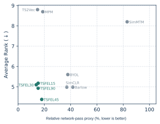

  

  
<b>Preferred direction:</b> lower leftProxy ≠ wall-clock time, FLOPs, memory, energy, or carbon.

Source: supplied manuscript, Figure 2 and §4.4. Original point geometry is preserved.

<!--
[Sources]
- Supplied workshop manuscript, pp. 6–7, §4.4 and Figure 2.
- The x-axis is proportional to network passes required for training. It is not a measured wall-clock, FLOP, memory, energy, or carbon quantity.
- SVG paths and point geometry are preserved from the paper's supplied vector figure. Colors, direct labels, and the x-axis wording were revised for precision and legibility; no exact x-values were inferred or quoted.
-->

---

Ablation · target size

## The preferred descriptor count differs by task

  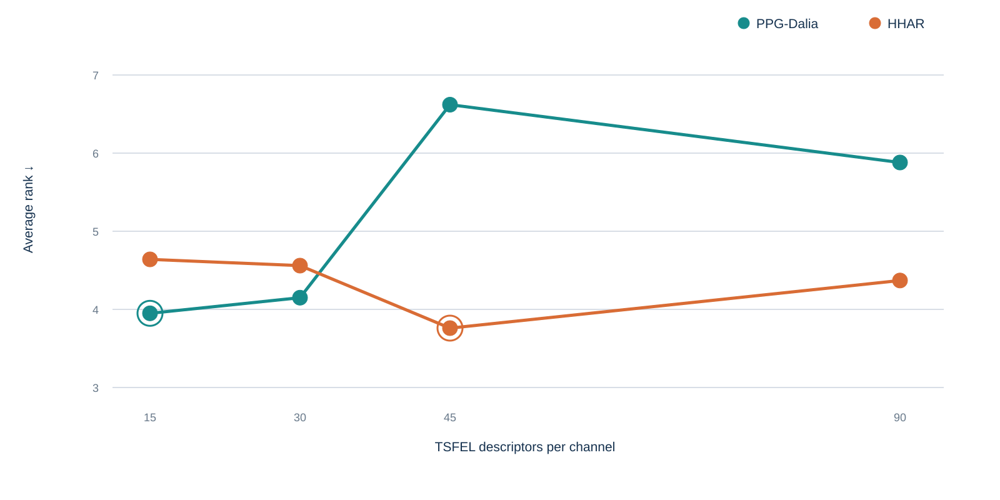
  

    

15

<strong>PPG-DaLiA</strong> lowest mean rank: 3.95

    

45

<strong>HHAR</strong> lowest mean rank: 3.76

    
More targets do not improve mean rank monotonically.

  

Source: supplied manuscript, Tables 2–3 and §4.3.2. Lower mean rank is better.

<!--
[Sources]
- Supplied workshop manuscript, Tables 2–3 and p. 6, §4.3.2.
- Exact PPG-DaLiA mean ranks for 15/30/45/90 descriptors: 3.95, 4.15, 6.62, 5.88.
- Exact HHAR mean ranks: 4.64, 4.56, 3.76, 4.37.
- Graphic is an editable SVG reconstructed from those exact table values. No trendline is fitted.
-->

---

Limits · what remains unresolved

## The experiments do not establish mechanism or broad transfer

  

    
<b>Two short-window wearable benchmarks</b>Heart-rate regression and six-class activity recognition.

    
<b>Matched evaluation across four backbones</b>Aggregate ranks over 1,600 training runs.

    
<b>Frozen and unfrozen transfer</b>Useful evidence on the evaluated tasks—not a universal claim.

  

  

    
not established

    <h3>Mechanism and scope</h3>
    <ul>
      <li>Statistical, temporal, and spectral families are not disentangled.</li>
      <li>No principled rule selects 15 / 30 / 45 / 90 targets.</li>
      <li>Long-context, forecasting, anomaly, and cross-domain transfer are untested.</li>
      <li>Augmentation-induced semantic loss is illustrated, not directly measured.</li>
    </ul>
  

Source: supplied manuscript, §7 Limitations.

<!--
[Sources]
- Supplied workshop manuscript, p. 7, §7 Limitations.
- The limitations copy closely follows the manuscript: descriptor choice remains an inductive bias; feature families are not ablated; subset selection lacks a principled rule; evaluation is limited to two wearable benchmarks with short fixed windows; motivating augmentation failures are not directly probed.
-->

---

<!-- _class: closing -->
<!-- _footer: '' -->

Conclusion · bounded claim

  

# Engineered descriptors provide useful self-supervision on the evaluated wearable tasks

  

    

01

Lowest task-level mean ranks on PPG-DaLiA and HHAR

    

02

Leading best-of-family ranks with a frozen encoder on both tasks

    

03

Favorable position under the paper's network-pass proxy

  

  
A complement to augmentation and reconstruction—not a universal replacement.

  

  

nipun.batra@iitgn.ac.in · Sustainability Lab, IIT Gandhinagar

<!--
[Sources]
- Supplied workshop manuscript, p. 7, §8 Conclusion.
- Task-level ranks: Tables 2–3. Frozen-transfer best-of-family ranks: Tables 4–5. Network-pass comparison: Figure 2 and §4.4.
- Closing visual: PPG-DaLiA Subject 1, samples 73,120–73,375 at 32 Hz, from the Edge Impulse subset of the UCI dataset, DOI 10.24432/C53890; subset documentation: https://docs.edgeimpulse.com/tutorials/end-to-end/hr-hrv-estimation . Derived distribution, autocorrelation, and periodogram values are documented in `provenance/ppg-intuition-assets.md`.
- The boundary statement mirrors the manuscript's conclusion that descriptor prediction is complementary to augmentation- and reconstruction-based approaches rather than universally superior.
-->
